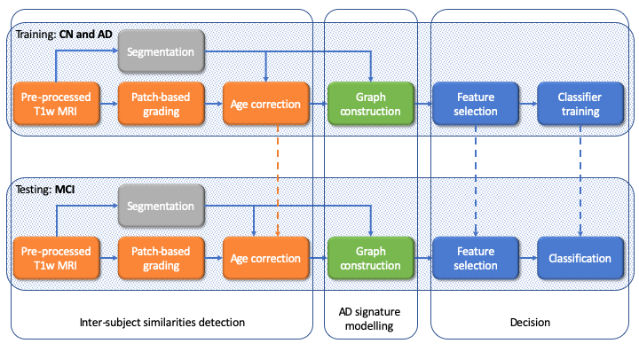
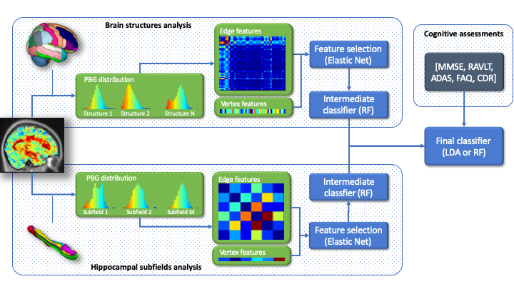
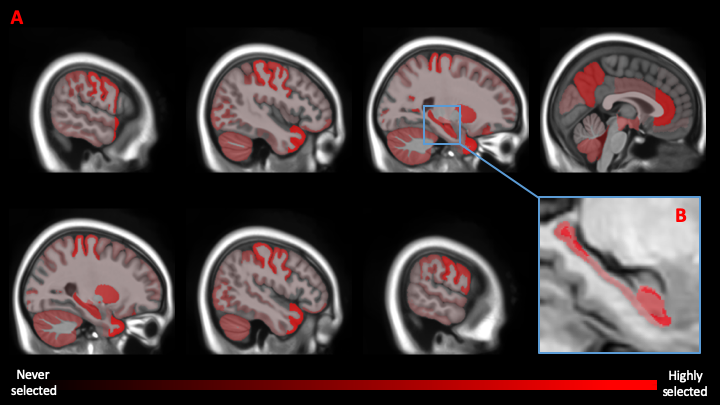

# Multi-scale Graph-based Grading

<p>Implementation of <b>Hett et al., Medical Image Analysis, 2020</b></p>


### Summary
- Implementation (graph construction)
    - main function : build_graph.m
```matlab
% G = build_graph(gmap, mask, options):  Compute the graph of
% structure grading for the subject under study
% 
% Agurments: 
%   - gmap
%       input.mri : path of the mri understudy
%       input.mask: mask of the region of interest
%       input.age : age of the subject understudy at scan
%   - mask
%       templates.t1_path  : list of path of the template mri
%       templates.mask_path: list of path of the template mask
%       templates.ages     : Vector of ages of templates at scan
%   - options 
%       options.A;              % [min, max] for each structure [Nstruct,2]
%       options.C;              % Age regression coefficients   [Nstruct,3]
%       options.nbins;          % Number of bins per histogram
%       options.age;            % Age of the subject under study
%       options.label_str;      % Label for each structure      [2, Nstruct]
%
% Return:
%   - G: Graph of grading structures
%       G.MS -> Mean of grading values within each structures (Vertices)
%       G.D  -> Distance of grading distributions between each pair of
%               structures (Edges)
```
    
- Evaluation
    - main scripts: main.m


## Abstract
<p align="justify">
The prediction of subjects with mild cognitive impairment (MCI) who will progress to Alzheimer's disease (AD) is clinically relevant, and may above all have a significant impact on accelerating the development of new treatments. In this paper, we present a new MRI-based biomarker that enables us to accurately predict conversion of MCI subjects to AD. In order to better capture the AD signature, we introduce two main contributions. First, we present a new graph-based grading framework to combine inter-subject similarity features and intra-subject variability features. This framework involves patch-based grading of anatomical structures and graph-based modeling of structure alteration relationships. Second, we propose an innovative multiscale brain analysis to capture alterations caused by AD at different anatomical levels. Based on a cascade of classifiers, this multiscale approach enables the analysis of alterations of whole brain structures and hippocampus subfields at the same time. During our experiments using the ADNI-1 dataset, the proposed multiscale graph-based grading method obtained an area under the curve (AUC) of 81% to predict conversion of MCI subjects to AD within three years. Moreover, when combined with cognitive scores, the proposed method obtained 85% of AUC. These results are competitive in comparison to state-of-the-art methods evaluated on the same dataset.</p>

<br>


## Method overview

<p align="justify">
As illustrated in Figure 1, our graph of structure grading method that combines inter-subjects' similarities and intra-subjects' variability is composed of several steps. 
</p>

<p align="justify">
First, a segmentation of the structures of interest is computed on the input images. Then, a patch-based grading (PBG) approach is conducted over every segmented structures (e.g., hippocampal subfields and brain structures). The two main alterations impacting the brain structures captured with PBG methods are the changes caused by normal aging [1] and the alterations caused by the progression of AD. Therefore, at each voxel, the grading values are age-corrected to avoid bias due to normal aging. After the patch-based grading maps are age-corrected, we construct an undirected graph to model the topology of alterations caused by Alzheimer's disease. This results in a high dimensional feature vector. Consequently, to reduce the dimensionality of the feature vector computed by our graph-based method, we use an elastic net that provides a sparse representation of the most discriminative elements of our graph (i.e., edges and vertices). We use only the most discriminative features of our graph as the input to a random forest method which predicts the subject's conversion.
</p>

<p align="center"><br>
<i>Fig. 1 Pipeline of the proposed graph-based grading method. PBG is computed using CN and AD training groups. CN group is also used to correct the bias related to age. Then, this estimation is applied to AD and MCI subjects. Afterwards, the graph is constructed, and the feature selection is trained on CN and AD and then is applied to CN, AD and MCI. Finally the classifier is trained with CN and AD.</i></p>
<br>

### Patch-based grading

<p align="justify">
Following image segmentation, a patch-based grading of the entire brain was performed using the method described in [3]. This method was first proposed to detect hippocampus structural alterations with a new scale of analysis [2]. The patch-based grading approach provides the probability that the disease has impacted the underlying structure at each voxel. This probability is estimated via an inter-subject similarity measurement derived from a non-local approach.
</p>

<p align="justify">
The method begins by building a training library T from two datasets of images: one with images from CN subjects and the other one from AD patients. Then, for each voxel x<sub>i</sub> of the region of interest in the considered subject x, the PBG method produces a weak classifier denoted, g<sub>x<sub>i</sub></sub>, that provides a surrogate for the pathological grading at the considered position i. A PBG value is computed using a measurement of the similarity between the patch P<sub>x<sub>i</sub></sub> surrounding the voxel x<sub>i</sub> belonging to the image under study and a set K<sub>x<sub>i</sub></sub> = {P<sub>t<sub>j</sub></sub>} of the closest patches P<sub>t<sub>j</sub></sub>, surrounding the voxel t<sub>j</sub>, extracted from the template t &isin; T. The grading value g<sub>x<sub>i</sub></sub> at x<sub>i</sub> is defined as:
</p>

<p align="center"></p>

<p align="justify">
where w(x<sub>i</sub>,t<sub>j</sub>) is the weight assigned to the pathological status p<sub>t</sub> of the training image t. We estimate w as:
</p>

<p align="center"></p>

<p align="justify">
where h=min ||P<sub>x<sub>i</sub></sub> - P<sub>t<sub>j</sub></sub>|| + &epsilon; and &epsilon; -> 0. The pathological status p<sub>t</sub> is set to -1 for patches extracted from AD patients and to 1 for patches extracted from CN subjects. Therefore, the PBG method provides a score representing an estimate of the alterations caused by AD at each voxel. Consequently, cerebral tissues strongly altered by AD have scores close to -1 while healthy tissues have scores close to 1. 
</p>

### Graph Construction

<p align="justify">
Once structure alterations were estimated using patch-based grading, we modeled intra-subject variability for each subject using a graph to better capture the AD signature. Indeed, within the last decade, graph modeling has been widely used for its ability to capture the patterns of different diseases [4]. This is achieved by encoding the relationships of abnormalities between different structures in the edges of the graph. Furthermore, graph modeling can also depict inter-subject similarity, by independently encoding the abnormality of each structure in the vertices measurement. Consequently, we proposed a graph-based grading approach that uses a graph model to combine inter-subject similarities computed with the PBG and intra-subjects' variability computed with the difference of the grading value distributions for each structure.
</p>

<p align="justify">
In our graph-based grading method, the segmentation maps were used to fuse grading values into each ROI, and to build our graph. We defined an undirected graph G=(V, E, &gamma;, &omega;), where V={v<sub>1</sub>,...,v<sub>N</sub>} is the set of vertices for the N considered brain structures, E=V&times;V is the set of edges, &gamma; and &omega; are two functions of the vertices and the edges, respectively. In our work, &gamma; is the mean of the grading values for a given structure while &omega; computes grading distribution distance between two structures. To this end, the probability distributions of PBG values were estimated with a histogram H<sub>v</sub> for each structure v. The number of bins was computed with Sturge's rule [6] using the average of number voxels that compose each brain structure or hippocampal subfields (i.e., histogram of whole brain structures and hippocampal subfields were estimated using different bin number). For each vertex we assigned a function &gamma;:V -> R defined as &gamma;(v) = &mu;<sub>H<sub>v</sub></sub>, where &mu;<sub>H<sub>v</sub></sub> is the mean of H<sub>v</sub>. For each edge we assigned a weight given by the function &omega;:E -> R defined as follows:
</p>

<p align="center"></p>

<p align="justify">
where W is the Wasserstein distance with L<sub>1</sub> norm [5] that showed best performance during our experiments. Indeed, this metric introduced by the optimal transport theory, aims to minimize the amount of work needed to rearrange the histogram H<sub>v<sub>i</sub></sub> to H<sub>v<sub>j</sub></sub>.
</p>

<p align="center"><br>
<i>Fig. 2 Schema of the proposed multi-scale graph-based grading method. First, the segmentation maps are used to aggregate grading values. Our method computes a histogram for each structure/subfield. Once the graphs are built, an elastic net is computed to select the most discriminating graph features for each anatomical scale. A first layer of random forest classifiers are computed to estimate a posteriori probabilities. Finally, a linear classifier is trained with the a posteriori probabilities from each anatomical scale to compute the final decision. A random forest classifier replaces the linear classifier for the multimodal experiments to deal with the feature heterogeneity resulting from the concatenation of a posteriori probabilities and cognitive scores.</i></p>


### Features selection

<p align="justify">
Completion of the previous step results in a high-dimensional feature vector. Because features computed from the graph-based grading method have varying significance levels, in this work, we used an elastic net regression method to provide a sparse representation of the most discriminating edges and vertices. This results in reducing the feature dimensionality by capturing the key structures and the key relationships between the different brain structures (see Figure 3). Indeed, it has been demonstrated that combining the L1 and L2 norms takes into account possible inter-feature correlation while imposing sparsity [7]. Finally, after normalization, the resulting feature vector is given as the input of the feature selection, defined as the minimization of the following equation:
</p>

<p align="center"></p>


<p align="justify">
where  is a sparse vector that represents the regression coefficients and X is a matrix with rows corresponding to the subjects and columns corresponding to the features, including: the vertices, the edges or a concatenation of both for the full graph of grading feature vector. &rho; and &lambda; are the regularization hyper-parameters set to balance the sparsity and the correlation inter-feature, and y represents the pathological status of each patient.
</p>

<p align="center"><br>
<i>Fig. 3 Representation of the most selected structures. The brain structures and hippocampal subfields are selected separately with the elastic net method. Frequently selected structures are colored using opaque red to transparent for structures never selected. (A) the most frequently selected brain structures are the temporal lobe, the postcentral gyrus, the anterior cingulate gyrus, the hippocampus and the precuneus. (B) the most frequently selected hippocampal subfields are the CA1-SP, the CA1-SRLM, and the subiculum.</i></p>


## References
[1] Koikkalainen, Juha, et al. "Improved classification of Alzheimer's disease data via removal of nuisance variability." PloS one 7.2 (2012): e31112.

[2] Coupé, Pierrick, et al. "Simultaneous segmentation and grading of anatomical structures for patient's classification: application to Alzheimer's disease." NeuroImage 59.4 (2012): 3736-3747.

[3] Hett, Kilian, et al. "Adaptive fusion of texture-based grading for Alzheimer's disease classification." Computerized Medical Imaging and Graphics 70 (2018): 8-16.

[4] Tong, Tong, et al. "Multi-modal classification of Alzheimer's disease using nonlinear graph fusion." Pattern recognition 63 (2017): 171-181.

[5] Rubner, Yossi, Carlo Tomasi, and Leonidas J. Guibas. "The earth mover's distance as a metric for image retrieval." International journal of computer vision 40.2 (2000): 99-121.

[6] Sturges, Herbert A. "The choice of a class interval." Journal of the american statistical association 21.153 (1926): 65-66.

[7] Zou, Hui, and Trevor Hastie. "Regularization and variable selection via the elastic net." Journal of the royal statistical society: series B (statistical methodology) 67.2 (2005): 301-320.
